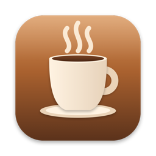
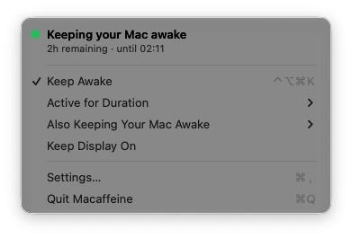
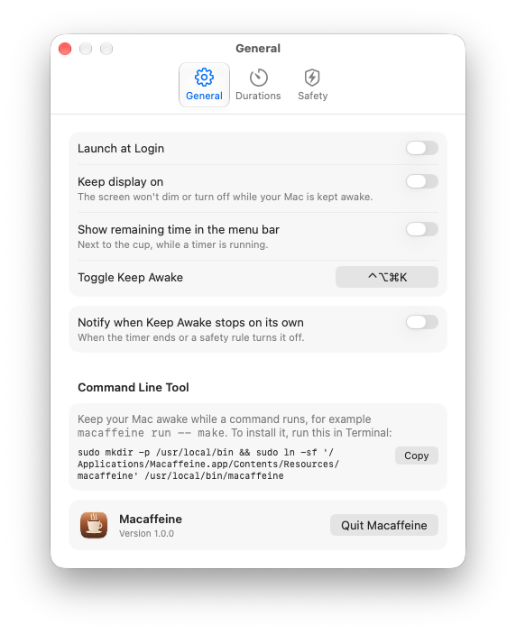
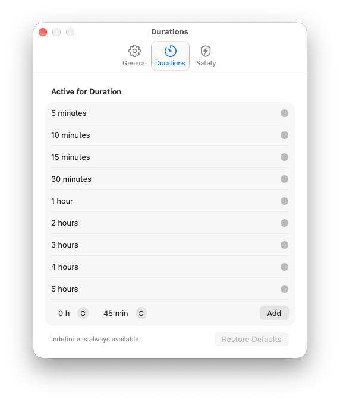
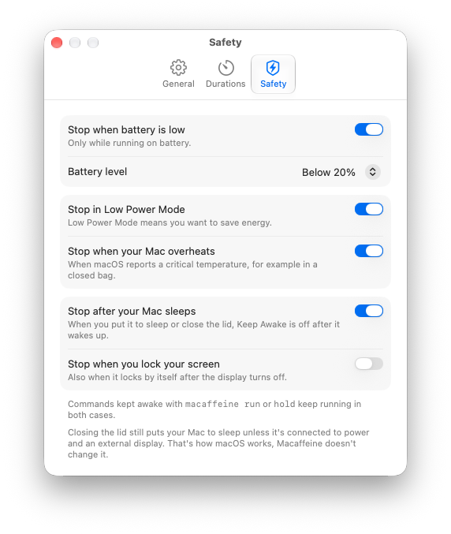

<p align="center">
  
</p>

<h1 align="center">Macaffeine</h1>

<p align="center">
  A tiny, native macOS menu bar utility that keeps your Mac awake while you're away.<br>
  No Electron. No background service. No account. No bullshit.
</p>

<p align="center">
  <a href="https://macaffeine.app"><b>macaffeine.app</b></a>
</p>

<p align="center">
  <a href="https://github.com/devopscodepro/macaffeine/releases/latest"></a>
  
  <a href="https://github.com/devopscodepro/macaffeine/actions/workflows/ci.yml"></a>
  <a href="LICENSE"></a>
</p>

<p align="center">
  <picture>
    <source media="(prefers-color-scheme: dark)" srcset="docs/images/menu-dark.png">
    
  </picture>
</p>

Built for those moments when you start a long build, deploy, AI agent, or remote job — and walk away for coffee. One click and your Mac stays awake. Come back, click again, and it sleeps like it normally does.

## Features

- **One click or one shortcut.** Toggle from the menu bar or press <kbd>⌃</kbd><kbd>⌥</kbd><kbd>⌘</kbd><kbd>K</kbd> from anywhere. The shortcut can be changed or turned off.
- **Timers that don't lie.** Keep awake indefinitely, for a preset (5 minutes to 5 hours by default, and you can add your own) or until a time of day. The countdown uses the real clock, so it stays right even if the Mac did sleep in between.
- **Your display can still sleep.** Only idle system sleep is blocked by default. Turn on *Keep Display On* when you need the screen too.
- **Safety first.** Keep awake stops by itself when the battery runs low, when Low Power Mode is on, or when the Mac gets critically hot. It also turns off after you put your Mac to sleep, so a forgotten session doesn't carry over — and optionally when you lock the screen.
- **Knows what else is going on.** The menu shows other apps and tools that are keeping your Mac awake and for how long, like a `caffeinate` someone forgot in a Terminal tab.
- **Made for automation.** A command line tool, a `macaffeine://` URL scheme, Shortcuts actions and ready-made hooks for AI coding agents.
- **Native and tiny.** Swift, AppKit and SwiftUI, about 1 MB zipped. Sandboxed, zero dependencies, zero network access.
- **Speaks your language.** English, 한국어, 简体中文 and Русский, picked from your system language.

## Install

1. Download `Macaffeine-x.y.z.dmg` from [Releases](https://github.com/devopscodepro/macaffeine/releases/latest).
2. Open it and drag the cup into **Applications**.
3. Launch Macaffeine. A cup appears in the menu bar — that's it.

A `.zip` is there too if you prefer it.

Builds are signed with a Developer ID and notarized by Apple. Requires macOS 13 Ventura or later, runs natively on Apple silicon and Intel.

## Using it

| Action | What it does |
|---|---|
| Click the cup | Open the menu |
| <kbd>⌃</kbd><kbd>⌥</kbd><kbd>⌘</kbd><kbd>K</kbd> | Toggle keep awake with the selected duration |
| **Active for Duration** | Pick how long. Picking a duration also turns keep awake on |
| **Until…** | Keep awake until a time of day |
| **Keep Display On** | Also keep the screen from dimming |

The cup is empty when your Mac can sleep and steaming when Macaffeine keeps it awake. The header at the top of the menu always says what's happening and why — including why it stopped, if a safety rule turned it off.

## Settings

<table>
  <tr>
    <td align="center"><b>General</b></td>
    <td align="center"><b>Durations</b></td>
    <td align="center"><b>Safety</b></td>
  </tr>
  <tr>
    <td>
      <picture>
        <source media="(prefers-color-scheme: dark)" srcset="docs/images/settings-general-dark.png">
        
      </picture>
    </td>
    <td>
      <picture>
        <source media="(prefers-color-scheme: dark)" srcset="docs/images/settings-durations-dark.png">
        
      </picture>
    </td>
    <td>
      <picture>
        <source media="(prefers-color-scheme: dark)" srcset="docs/images/settings-safety-dark.png">
        
      </picture>
    </td>
  </tr>
</table>

- **General** — launch at login, keep display on, remaining time next to the cup, the global shortcut, notifications and the command line tool.
- **Durations** — the presets in the menu. Add your own, remove the ones you never use.
- **Safety** — battery level, Low Power Mode, overheating, sleep and screen lock rules.

## Automation

Install the command line tool once (Settings → General shows the command with a Copy button), then:

```sh
macaffeine run -- make release      # awake while the command runs
macaffeine on 2h                    # or 45m, 90, indefinite, --until 18:30
macaffeine off
```

`run` keeps your Mac awake exactly as long as the command runs, passes its exit code through, and lets go even if the command is interrupted or killed.

Other ways in:

- **URL scheme** — `open -g "macaffeine://activate?minutes=90"`, handy from Raycast, Alfred or scripts.
- **Shortcuts** — *Keep Mac Awake*, *Allow Mac to Sleep*, *Toggle Keep Awake* and *Is Mac Kept Awake* actions.
- **AI coding agents** — hooks for Claude Code keep the Mac awake only while the agent is working; wrap Codex, Gemini or anything else with `macaffeine run`.

Everything is described in [docs/automation.md](docs/automation.md).

## FAQ

**Does it keep my Mac awake with the lid closed?**
No. macOS always sleeps when you close the lid, unless the Mac is connected to power and an external display. Forcing it needs admin rights and can overheat a Mac in a bag, so Macaffeine doesn't do it on purpose.

**How is it different from `caffeinate`?**
It uses the same power assertions macOS offers, but you get a menu, timers, safety rules and a clear status instead of a Terminal tab you have to remember about. If Macaffeine quits or crashes, macOS releases its assertion right away — your Mac never stays awake by accident.

**Does it collect anything?**
No. There's no network code at all. Settings stay in your user defaults.

**I don't see the cup in the menu bar.**
On Macs with a notch or with many menu bar icons it can end up hidden. Open Macaffeine again from Applications or Spotlight and Settings will show up, including a Quit button.

## Building from source

Requirements: Xcode 16 or later.

```sh
git clone https://github.com/devopscodepro/macaffeine.git
cd macaffeine
xcodebuild -project Macaffeine.xcodeproj -scheme Macaffeine -configuration Release -derivedDataPath build build
open build/Build/Products/Release/Macaffeine.app
```

Run the tests with:

```sh
xcodebuild -project Macaffeine.xcodeproj -scheme Macaffeine -derivedDataPath build test
```

Local builds are signed ad hoc, no Apple Developer account needed.

## Contributing

Bug reports, translations and small pull requests are welcome — see [CONTRIBUTING.md](CONTRIBUTING.md). Questions and ideas go to [Discussions](https://github.com/devopscodepro/macaffeine/discussions), security issues to a [private report](SECURITY.md).

## License

[MIT](LICENSE) © 2026 Aleksei Popov
